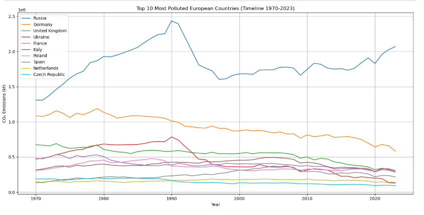
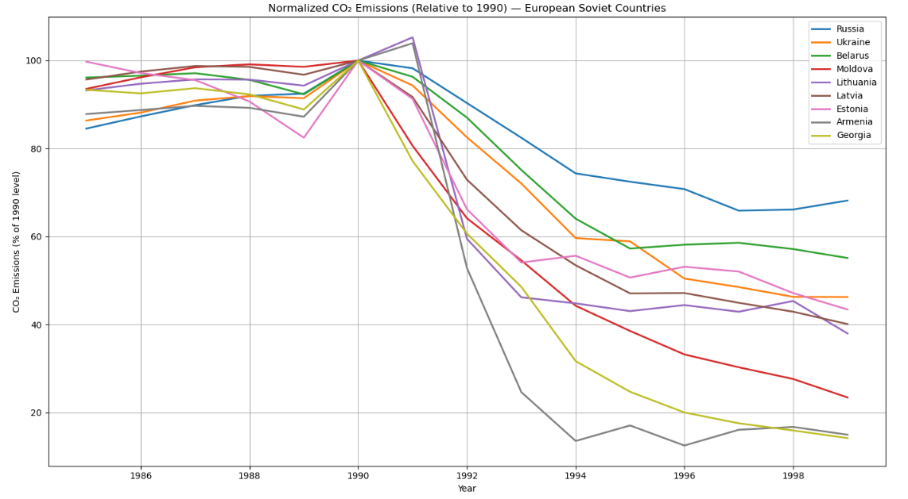
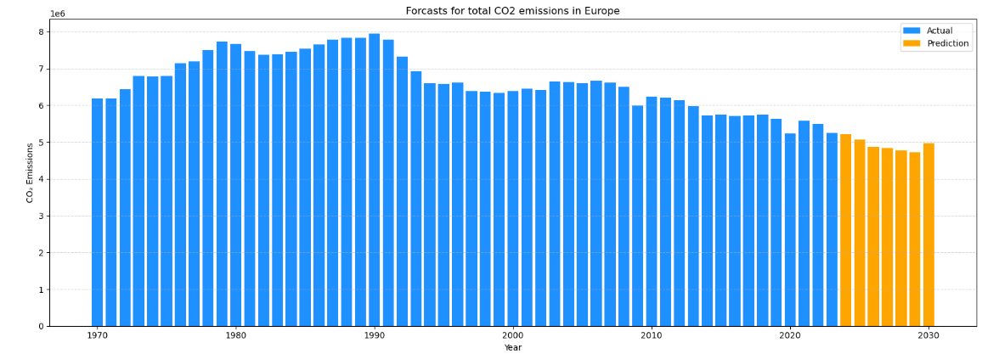

# Analysis of CO₂ Emissions in Europe

## 1.1 Members

- Filip Vichoroski
- Angel Karali 
- Ivana Vasilevska
- Tjas Likar Vavken

## 1.2 Introduction

Global climate change is one of the most pressing issues of our time. CO₂ emissions from fossil fuels and industrial processes are the leading contributors to global warming. This project explores the evolution of CO₂ emissions across European countries, examines the effectiveness of major international climate agreements, and identifies key drivers of emissions.

We also provide interactive tools to visualize and understand emissions by country, sector, and economic indicators, with the goal of revealing actionable insights.

## 2. Data

Our datasets come from reputable sources including the European Union’s official databases such as Eurostat and EDGAR, as well as other public repositories like Kaggle. During the data preparation phase, we filtered out datasets that were not from official or reliable sources to ensure data quality and consistency. Additionally, we supplemented the data by adding countries that were initially missing, allowing for a more comprehensive and accurate analysis across Europe.

## 3. Data analysis 

### 3.1 Average CO2 Emissions

This section focuses on the top 10 European countries with the highest average CO₂ emissions. As expected the top CO2 emission countries are the bigger ones with highly developed industries.The leading country is Russia, followed by Germany, UK, Ukraine, France and Italy.

### 3.2 Top 10 most polluted countries (Timeline 1970-2023)

Here we can see that Russia and Ukraine had a massive dropdown in CO2 emission somwhere in the year 1990. That was because of the collapse of the Soviet Union. In the next picture we can see how did that affect the other countries in that Union.

### 3.3 Normalizaed CO2 Emissions(Relative to 1990) - European Soviet Countries 

All the countries that were in the Soviet Union had a rapid decreasing in CO2 emissions and the country that had the biggest percentage was Armenia. That seemes logical cause Armenia in that period of time had :

Nagorno-Karabakh conflict (1988–1994): Military tensions with Azerbaijan disrupted borders and trade.

Blockade by neighboring countries: Severely limited access to energy supplies (especially gas and oil).

Shut down of the Metsamor Nuclear Power Plant after the 1988 earthquake (until 1995).

Severe energy crisis in the early 1990s (frequent blackouts and limited industrial activity).

### 3.4 Emissions per Capita and GDP per Capita (2022)

The maps of European CO₂ and GDP per capita show clear contrasts in how wealth relates to emissions. Russia has high CO₂ emissions despite moderate GDP, pointing to energy-intensive industries. Sweden, with high GDP and low emissions, shows effective environmental policies and clean energy use. Germany ranks high in both, reflecting its strong industrial base, while Switzerland combines high wealth with low emissions, suggesting efficient and clean development. These patterns reveal that emissions depend not just on wealth, but also on energy sources, policies, and technology.

###  3.5 Emission per Million USD GDP by European Country

The map clearly shows which countries emit the most CO₂ per $1,000,000 of GDP. High emitters include Ukraine, Russia, Estonia, and Bulgaria, while low emitters include Switzerland, Norway, and Sweden. Generally, wealthier countries have lower carbon intensity, likely due to better technology and cleaner energy. Russia stands out for its high emissions, driven by heavy fossil fuel use and energy-intensive industries.

### 3.6 Correlation between Population density and Co2 emissions per capita (2020)

The scatter plot shows no clear link between population density and CO₂ emissions per capita in Europe (2020). Luxembourg and Russia are outliers with high emissions despite differing densities. Malta, though the most densely populated, has low emissions. This suggests that energy use, economy, and transport matter more than population density alone.

### 3.7 Correlation between cumulative Co2 and temperature annomaly 

The trendline going upward indicates that as cumulative CO₂ emissions increase, so does the average temperature anomaly in Europe. The dots scattered around the line represent data points for each year — their proximity to the line shows how closely the data follows the general trend.A correlation of 0.95 means there's a very strong positive linear relationship — as CO₂ accumulates, temperature rises almost proportionally.

### 3.8 Percentage of Co2 emissions by sector per cluster  

We identified 4 clusters of European countries based on sectoral CO₂ emissions:

Cluster 1 (e.g. Estonia, Ireland): Small economies heavily reliant on public electricity and heat production (the top emitting sector at 40.2%).

Cluster 2 (e.g. Albania, Malta): Transitional economies with emissions split between electricity, transport, and industry—electricity is again the largest contributor at 33.1%.

Cluster 3 (e.g. Austria, Sweden): Diversified, mature economies with balanced emissions; electricity production still leads at 32.1%.

Cluster 4 (e.g. Germany, Russia): Large, high-demand economies dominated by public electricity and heat production, which is also the main emitting sector at 39.1%.

Across all clusters, public electricity and heat production is consistently the largest source of CO₂ emissions, confirming the energy sector’s dominant environmental impact.

### 3.9 Co2 Emissions per Capita after the breakup of Yugoslavia 

Pre-breakup (1985–1990): Emissions were relatively stable, reflecting Yugoslavia’s unified industrial policies.

Post-breakup (1990s): Likely a drop in emissions due to economic collapse, war devastation, and halted industrial activity (especially in Bosnia, Serbia, and Croatia).

2000s Recovery: Gradual increase as economies stabilized, but divergence emerges based on energy policies and EU integration.

2010s–2020: EU members (Slovenia, Croatia): Emissions decline due to stricter environmental regulations and renewable energy adoption. Non-EU countries (Serbia, Bosnia, N. Macedonia, Montenegro): Emissions remain higher, tied to coal dependence and slower green transitions.

### 3.10 Forecasting CO₂ Emissions (2020–2030)

To forecast emissions, we tested several models and chose the best performer for each country. For Greece, SARIMA gave the most reliable results.

To improve accuracy, we created features like:

Policy markers (Kyoto, Paris)

Lagged emissions (1–3 years)

Rolling stats (mean & std over 3 years)

The forecast shows a slow but steady decline in CO₂ emissions, continuing the post-2010 downward trend—likely driven by EU regulations and clean energy adoption.

The grouped overall CO2 emissions for Europe's countries that we had in the dataset. We can see a decline of CO2 emissions in the near future.
