# Analysis of CO₂ Emissions in Europe

## 1.1 Members

- Filip Vichoroski
- Angel Karali 
- Ivana Vasilevska
- Tjas Likar Vavken

## 1.2 Introduction

This project focuses on analyzing CO2 and other harmful gas emissions. The main goal is to study how different factors impact these emissions and identify potential contributors. By conducting this analysis, we aim to gain a better understanding of the relationships between human activities and gas emissions.

## 2. Data

Our datasets come from reputable sources including the European Union's official databases such as EDGAR and other sources like Kaggle. During the data preparation phase, we encountered some issues with certain European countries, which required additional filtering to bring them into a usable format. The datasets include annual CO2 emissions (in kilotons) for countries worldwide from 1970-2023. They do not only provide total emissions per country but also break them down by sector, showing how much CO2 each sector contributes. Additionally, we used various datasets to obtain information on European countries population, GDP, and climate change, which we later used to compare against CO2 emissions.

## 3. Data analysis 

### 3.1 Average CO2 Emissions

This section focuses on the top 10 European countries with the highest average CO2 emissions. As expected the top CO2 emission countries are the bigger ones with highly developed industries. As seen in the plot above the leading country is Russia, followed by Germany, UK, Ukraine, France and Italy.

### 3.2 Top 10 most polluted countries (Timeline 1970-2023)

To gain a clearer view and understanding of CO2 emission trends during the analysis period (1970-2023), we created a timeline visualization of the top 10 European countries with the highest average CO2 emissions over the years.

The plot clearly shows a sharp decline in CO2 emissions for Russia and Ukraine around 1990, prompting further investigation into this unusual drop. Our research revealed that this was due to the collapse of the Soviet Union, which led to the shutdown of many factories and other factors that significantly reduced CO2 emissions.

### 3.3 CO2 emissions per capita  

We realized that analyzing CO2 emissions in isolation wasn't sufficient for meaningful insights. Therefore, we performed additional comparisons involving CO2 emissions. In the next map visualization, we present the results of comparing CO2 emissions with each country's population.

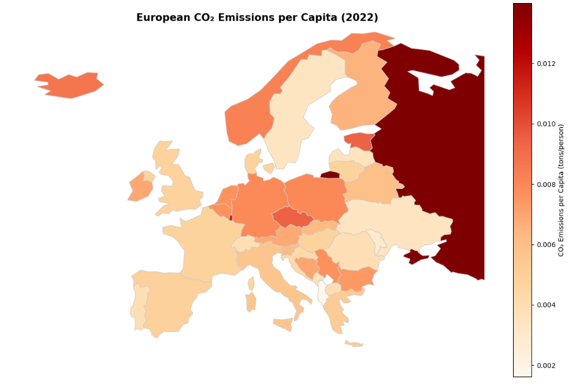

At first glance, the results shown on the map appear promising. However, a closer analysis reveals that some countries with relatively small populations, such as Luxembourg, rank disproportionately high-an outcome that doesn't align with expectations. This suggests that this approach may not be the most reliable for drawing accurate conclusions.

### 3.4 CO2 emissions per Million USD GDP

The next analysis involved comparing CO2 emissions with each country's GDP. Specifically, we calculated the amount of CO2 emitted per $1,000,000 of GDP. This approach gived the following results.

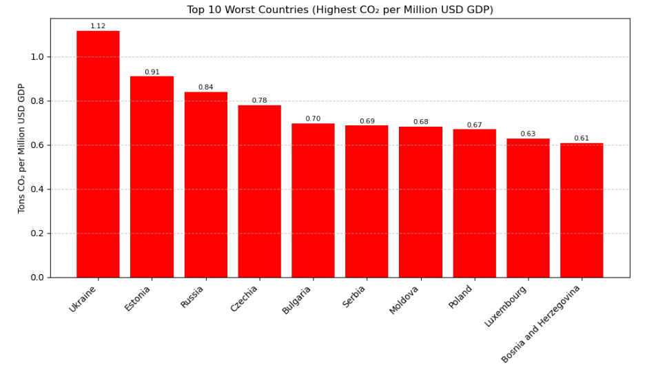

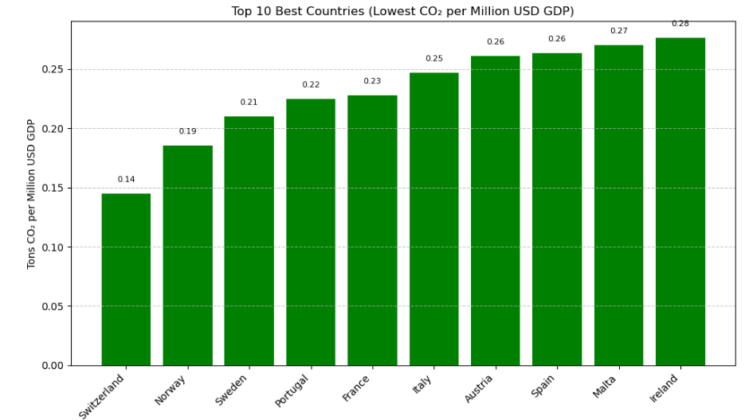

The plots reveal a clear pattern: Western European countries perform best due to developed, service-based economies and strong environmental regulations, leading to lower CO₂ emissions per unit of GDP. In contrast, Eastern European countries like Ukraine, Russia, and Moldova still rely heavily on fossil fuels, resulting in higher emissions. This reflects the economic and infrastructural divide in sustainability between Western and Eastern Europe.

###  3.5 Emission per km²

The final analysis we conducted measured CO2 emissions per km² for each European country, giving the following results:

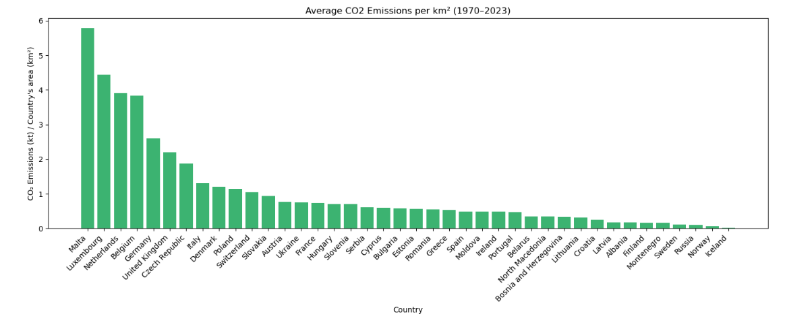

Among all the methods we used to compare CO2 emissions with other factors, this one clearly performed the worst, as it ranked the smallest countries highest due to their small surface area.

Overall, analyzing average CO2 emissions alone proved to be the most effective approach for this problem. Comparing by GDP came in a close second, followed by population, with area-based analysis ranking last.

### 3.6 Leading sectors in CO2 emissions

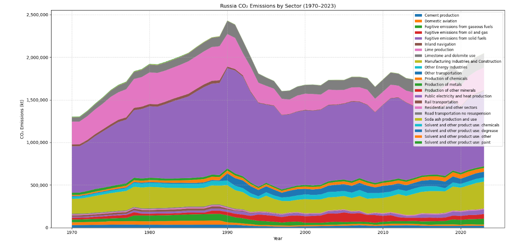

By analyzing and visualizing the sectors contributing most to CO2 emissions in the top 5 highest-emitting countries, we identified the following key sectors as the primary contributors:

- Public electricity and heat production
- Residential and other sectors
- Manufacturing Industries and Construction
- Road transportation no resuspension
- Other Energy Industrie
- Cement production
- Production of chemicals
- Fugitive emissions from solid fuels
- Production of metals
- Lime production
- Fugitive emissions from oil and gas
- Fugitive emissions from gaseous fuels
- Other direct soil emissions
- Inland navigation
- Rail transportation
- And others...

For which, we calculated the correlation with each European country, giving promising results as shown in the plot below.

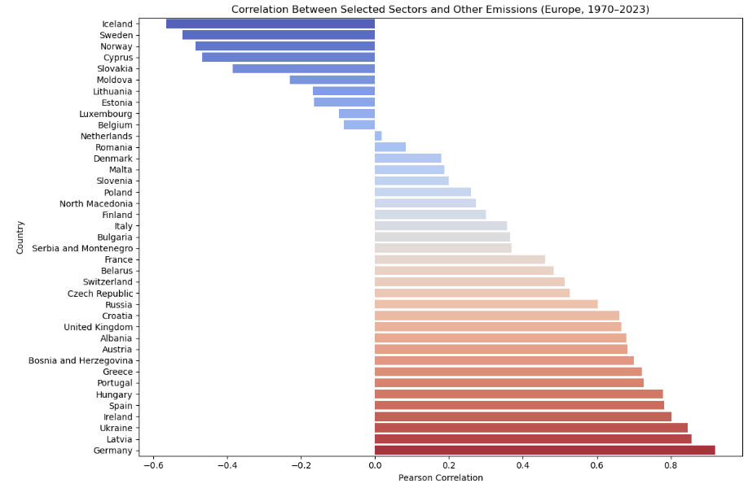

### 3.7 Clustering European Countries by their CO2 emissions

To cluster the countries in our datasets, we tried several approaches, all giving promising results. The most effective method was clustering based on each country's GDP efficiency combined with their CO2 emissions.
We performed the clustering using the KNN algorithm and determined the optimal value of "K" using the Elbow Method (a technique that involves plotting the sum of squared errors for different K values and identifying the point where the rate of improvement sharply decreases, forming an "elbow" in the graph), yielding the following results:

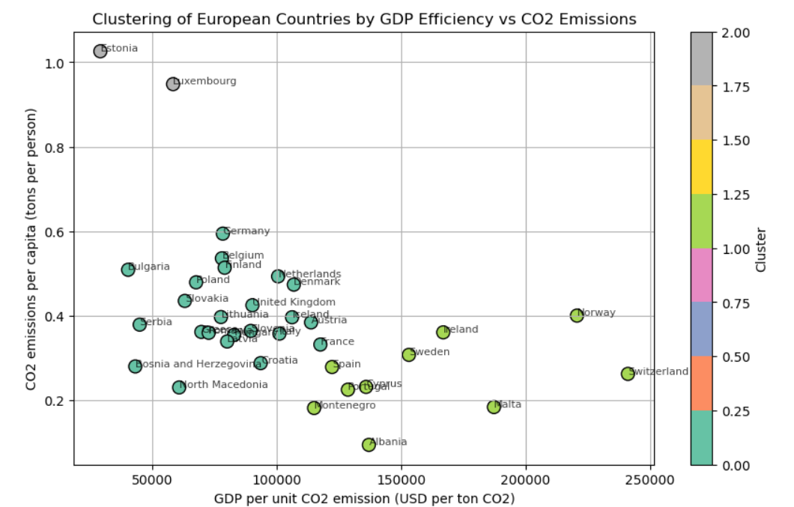

From the scatter plot we can see the formed clusters, such as:

- Cluster 0: High GDP efficiency and low emissions (Switzerland, Norway, Sweden and others.)
- Cluster 1: Low GDP efficiency and high emissions (Estonia and Luxembourg)
- Cluster 2: Moderate GDP efficiency and moderate emissions (Germany, Italy, UK).

### 3.8 CO2 emission forecast   

From our dataset, we generated CO2 emission predictions for each country up to 2030. Using yearly data, we extracted features and trained several machine learning models to forecast future emissions.

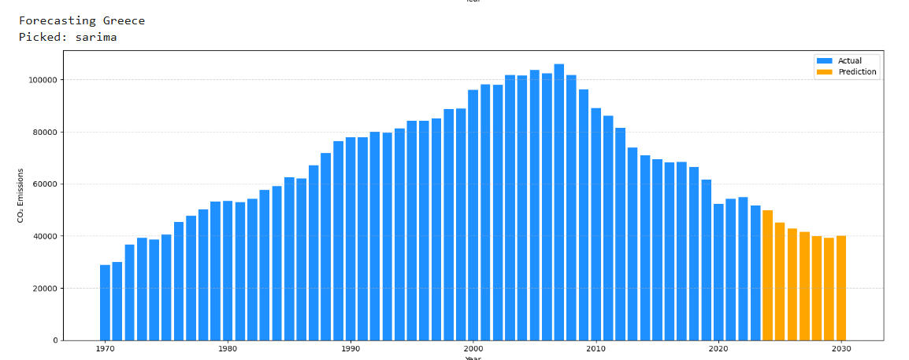
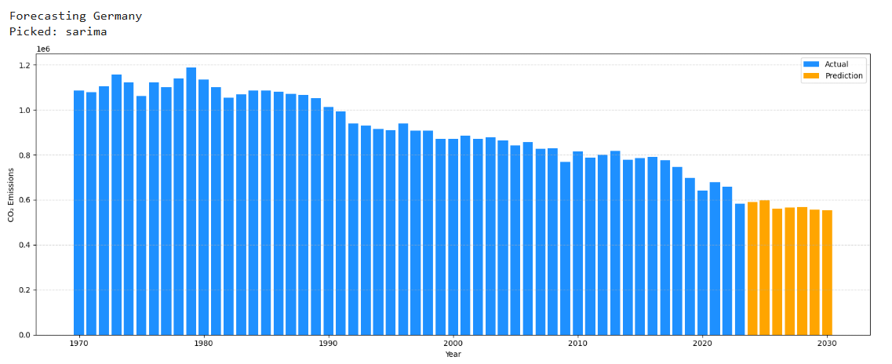

In the end we picked the SARIMA model because it effectively captured the trend and provided good predictions. We can see the example for Germany and Greece how the forecast follows the trend of the emissions.

The final image shows results for all European countries, countries present in the dataset, indicating a decline in emissions in both the actual data and the forecasts.

### 3.9 Key Periods and Events in European CO2 Emissions (1970-2023)

During this project, we came across several interesting findings in our visualizations that prompted further investigation into key factors potentially contributing to CO2 emissions.

#### Impact of the Breakup of Yugoslavia

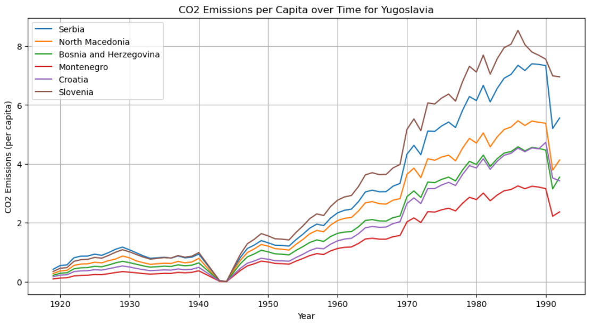
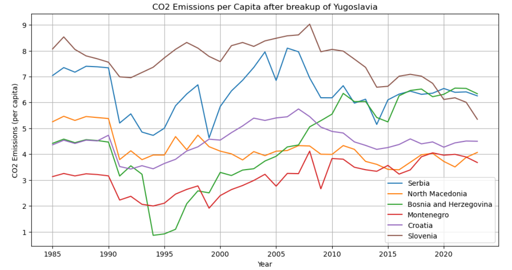

The plots show that before the breakup (1975-1990), emissions were relatively stable, reflecting Yugoslavia's unified industrial policies. After 1990, there is a sharp decline in emissions caused by economic collapse, war damage, and halted industrial activity-particularly in Bosnia, Serbia, and Croatia.

#### The Collapse of the Soviet Union

Similarly, all countries that were part of the Soviet Union experienced a rapid decrease in CO2 emissions, with Armenia showing the largest percentage drop. This decline was likely caused by the collapse of heavy industries, economic disruption, and reduced energy production following the dissolution of the Soviet Union.

#### The Nuclear Phase-Out in Germany

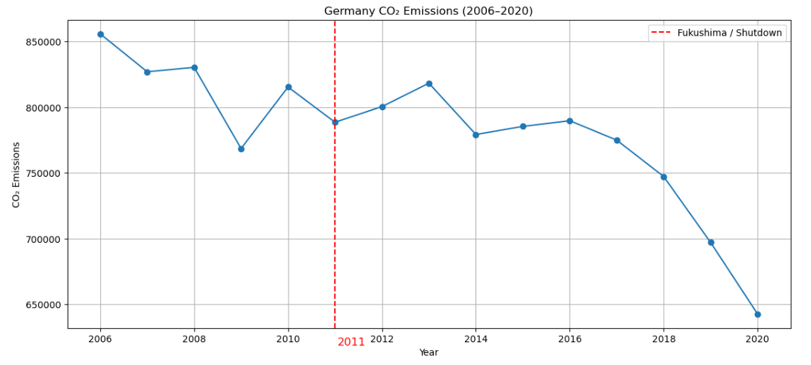

The decision to phase out nuclear energy in Germany in 2011 appears to have caused a short-term increase in CO2 emissions. As nuclear power plants-which generate electricity without direct carbon emissions-were gradually shut down, Germany had to compensate for the lost energy by relying more on fossil fuels.

#### The Kyoto Protocol and the Paris Agreement

The Kyoto Protocol (1997) and the Paris Agreement (2015) are key international milestones that shaped Europe's CO2 emissions policies. Both agreements set targets to reduce greenhouse gas emissions, driving many European countries to implement stricter environmental regulations and transition to cleaner energy sources.

## 4. Overview

### 4.1 Overview of the project

As a final overview of the project, our analysis showed that CO₂ emissions increased in nearly every European country up to a certain point in time. This trend began to reverse when more developed countries started adopting renewable energy sources, leading to a gradual decline in emissions across much of Europe-marking a positive shift toward a more sustainable and environmentally conscious future.

### 4.2 Streamlit application

If you're interested in exploring more of our work-including additional visualizations and some interactive ones-check out our [Streamlit application](https://pr2515-co2-emissions-in-europe.streamlit.app/).

