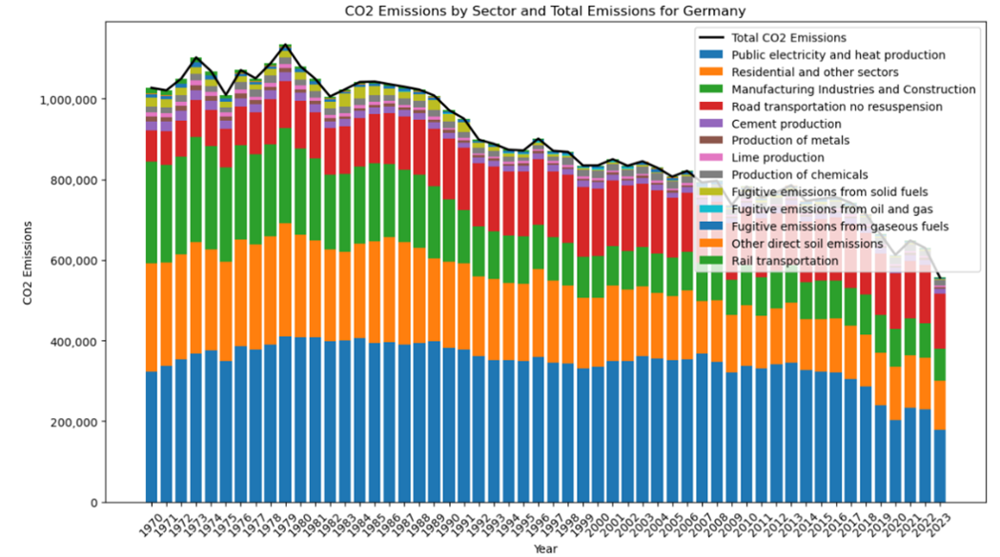

# CO2 and Harmful Gas Emissions Analysis

## 1. Overview

This project focuses on analyzing CO2 and other harmful gas emissions. The main goal is to study how different factors impact these emissions and identify potential contributors. By conducting this analysis, we aim to gain a better understanding of the relationships between human activities and gas emissions.

### Objectives

- Analyze the impact of various factors on CO2 and other harmful gas emissions.
- Identify potential contributors to emissions.
- Develop insights into trends and correlations.
- Provide visualizations for better interpretation of results.
- Use visualization tools to interpret correlations effectively.
- Make predictions about future CO2 emissions based on identified trends and contributing factors.

### Expected Results

- Better understanding of the impact of various factors on CO2 and harmful gas emissions.
- Visualization tools that will allow a better understanding of the connections.

## 2. Project Overview

In this project, our main goal is to analyze how much CO₂ and other harmful gases are produced in Europe. We're especially interested in identifying which countries are the biggest polluters and which ones produce the least emissions, based on yearly data from 1970 to 2023. This includes looking at both the total emissions and how they’ve changed over time.

We also wanted to connect the data to major global events, such as the COVID-19 lockdowns. Events like these tend to have a noticeable impact on human activity, which can clearly show up as sudden drops or increases in emissions. These patterns are not just interesting to look at—they also help us better understand the real-world consequences of policy changes, crises, or economic slowdowns.

Another important part of our research is analyzing how different economic sectors contribute to emissions. We’re looking at data across industries like transportation, agriculture, energy production, manufacturing, etc. Some countries have higher emissions due to a strong industrial base, while others might have large agricultural sectors or heavy traffic and transport. By breaking this down, we can better see where each country’s emissions are really coming from and possibly highlight areas for improvement.

### 2.1 Data and Tools

We are using publicly available datasets from a trusted source — The Intergovernmental Panel on Climate Change (IPCC).

The dataset includes annual CO2 emissions (in kilotons) for countries worldwide from 1970 to 2023. It not only provides total emissions per country but also breaks them down by sector, showing how much CO2 each sector contributes. Additionally, there's a Region column, which allows us to filter and focus specifically on European countries for our analysis.

### 2.2 Our Approach and Key Findings

Here’s a summary of the steps we’ve taken so far:

- Collected and cleaned the raw emissions data for European countries from 1970 to 2023.
- Created a ranking of the top 10 most and least polluting countries.
- Created graphs that show correlations of each sector with total CO2 emissions in certain European countries and Europe.
- Calculated the share of global CO2 emissions by sector for the whole Europe.
- Identified the right distribution for our data.
- Determined the leading sectors of the top 10 European countries with the most CO2 emissions.
- Listed leading factors in CO2 emissions.

One of the main things we discovered is that **Germany consistently produces the most emissions in Europe**. This isn’t surprising, as Germany has the largest economy and a big industrial sector, which means more energy use and more pollution. Other top emitters include the **United Kingdom, France, and Italy**.

On the other end of the scale, the countries with the **lowest emissions** are smaller nations like **Malta, Iceland, and Luxembourg**. According to the data, Malta produces the least emissions overall, which makes sense given its small size and population.

But if we normalize emissions based on population or GDP, we would start to get a very different picture. Some smaller countries, when adjusted for population, would probably produce more emissions per person than larger countries. This is a key insight, because it shows that simply looking at total emissions doesn’t always tell the full story. Countries with smaller populations might still have high emissions per capita, depending on how their economies are structured and how energy is produced and consumed.

One of many (and many more to come) interesting observations is the **downward trend in emissions** in many countries over the last decade. This is likely a result of climate policies, better energy efficiency, and the shift towards renewable energy. However, there are some noticeable spikes and drops in the data. For example, during the **COVID-19 pandemic in 2020**, almost every country experienced a sudden decrease in emissions. This was expected, as people were traveling less, factories shut down, and economic activity slowed. It’s a real-life example of how strongly emissions are tied to human behavior.

## What’s Next?

We’re still working on digging deeper into sector-based emissions and trying to understand how certain policy changes or technological advancements (like electric vehicles or solar energy) have influenced the trends we see in the data.

In the next phase, we plan to:
- Improve our visualizations, so they better highlight key insights.
- Create interactive charts or maps.
- Dive deeper into the relationship between certain factors, which will lead to new interesting data.

We also want to include more context and annotations in our graphs to point out important years or shifts.

  

  

  

